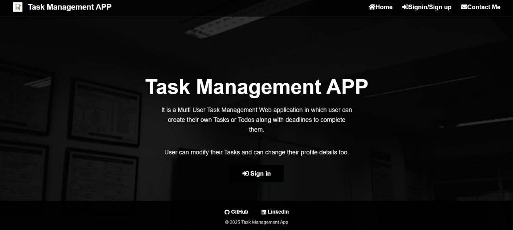
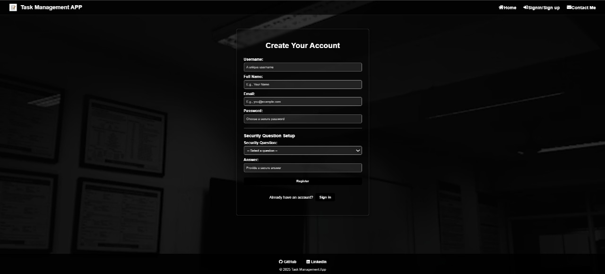
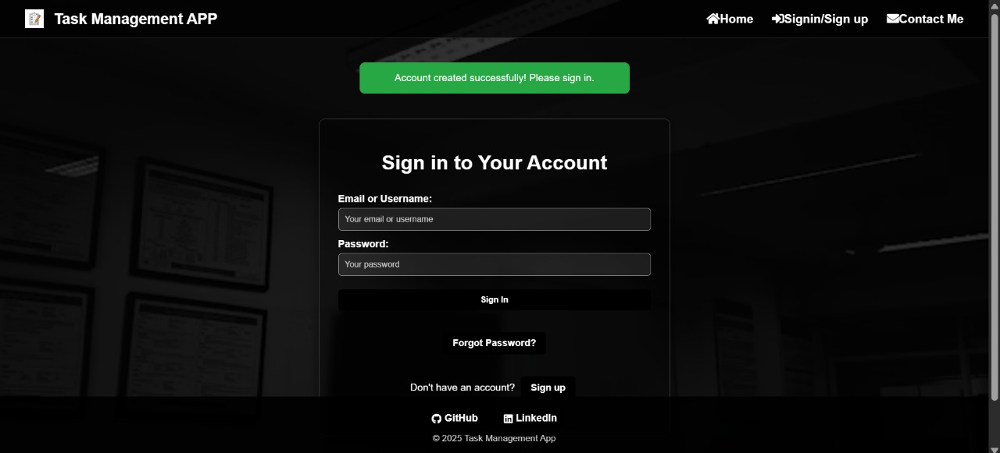
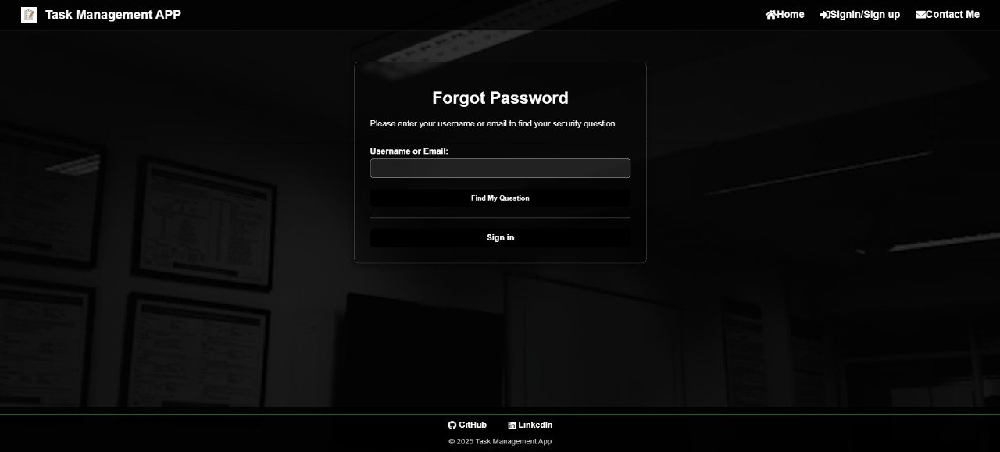
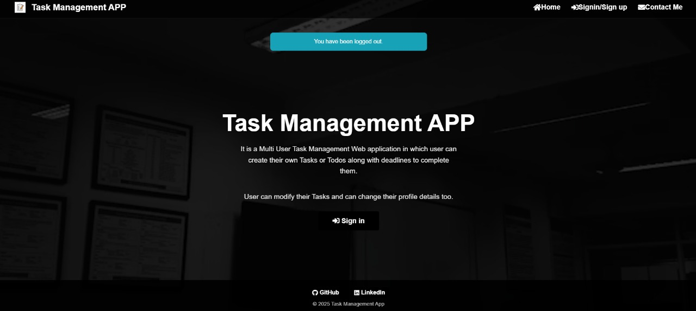
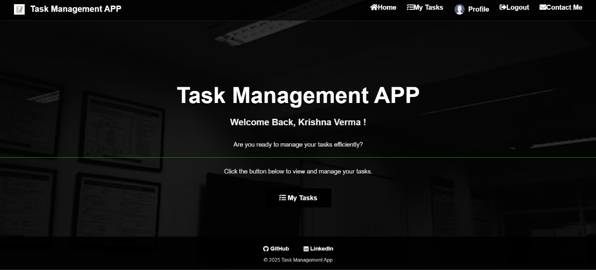
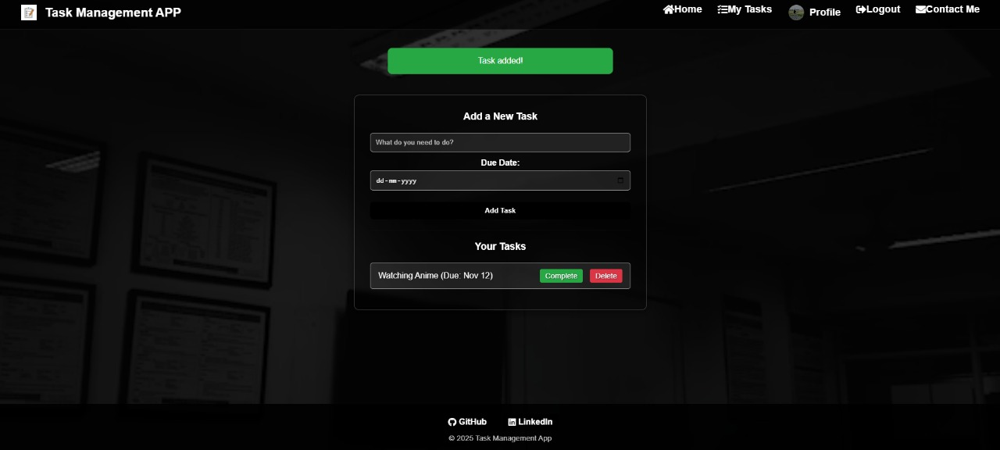
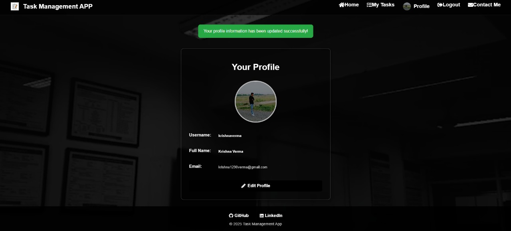
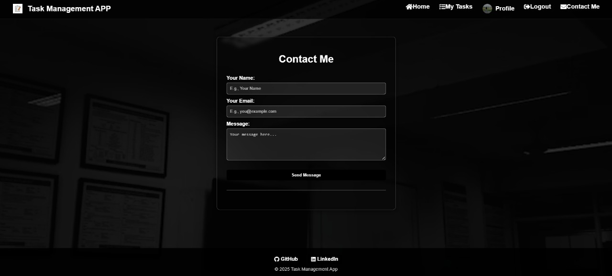

# 🚀 Task Management System
## 📄 Description
This is a **Task Management System (TMS)** designed to help individuals and teams manage their tasks efficiently. It provides a personalized, multi-tenant interface where users can view, create, update, and track their tasks, ensuring privacy and organization for each user.
The application is hosted locally at **`http://127.0.0.1:5000/`** during development and deployed server at **`https://task-management-app-i1v3.onrender.com/`**.
---
## ✨ Features
* **User Authentication:** Secure user registration, login, and logout.
* **Personalized Dashboard:** A personalized welcome screen (e.g., "Welcome Back, Krishna Verma").
* **Task Management (CRUD):** Core functionality to **Create, Read, Update, and Delete** tasks. This includes **viewing a list of all tasks** and **tracking their status** (e.g., *To Do, In Progress, Complete*).
* **Add Task** User can add the Task here.
* **User Profile:** Access to user profile settings and profile updating.
* **Contact Me:** A dedicated contact mechanism.

---
## 📸 Features and Visual Demo

The following images visually demonstrate the key features and user flow of the application:

### **1. Authentication & Entry**
| Page Name | Description | Image File |
| :--- | :--- | :--- |
| **Landing Page** | The initial page for users. | `landing.jpg` |
| **Create Account** | The secure registration form. | `create_account.jpg` |
| **Sign In** | The login screen for registered users. | `login.jpg` |
| **Forgot Password** | Recovery mechanism via security question. | `forgot_password.jpg` |
| **Sign Out** | Confirmation screen after signing out. | `logout.jpg` |

### **2. Core Functionality**
| Page Name | Description | Image File |
| :--- | :--- | :--- |
| **Personalized Dashboard** | The main welcome screen after login. | `defaultpage.jpg` |
| **Add/View Tasks** | Interface for creating, viewing, and managing tasks (CRUD). | `add_task.jpg` |
| **User Profile** | Page showing current user details. | `update_profile.jpg` |
| **Contact Me** | The dedicated contact form. | `contact_me.jpg` |
---

## ✨ Screenshots
This section visually demonstrates the key features and user flow of the Task Management System:

1. Authentication & Entry
Landing Page:
The initial entry point for the application, providing a brief description and an entry button.



Create Account: 
The secure registration form, including setup for a security question. 



Sign In: 
The login screen for registered users. 



Forgot Password: 
The recovery mechanism used to prompt the user for their security question. 



Sign Out: 
The confirmation screen displayed after a successful sign-out. 



2. Core Functionality
Personalized Dashboard:
The main welcome screen displayed immediately after a successful login.



Add/View Tasks (CRUD): 
The interface for creating new tasks with a due date, viewing existing tasks, and managing their status (Complete/Delete). 



User Profile: 
The page showing current user details, including a profile picture, and offering an 'Edit Profile' function for updates. 



Contact Me: 
The dedicated contact form for user feedback or support requests. 



---
## 🛠️ Tech Stack
* **Backend:** Python (**Flask** given the `127.0.0.1:5000` default port).
* **Frontend:** HTML, CSS, JavaScript.
* **Database:** PostgreSQL.
* **Database ORM/Library:** `SQLAlchemy`
---
## 💻 Installation and Setup
### Prerequisites
* Python 3.x
* `pip` (Python package installer)
### Local Setup
1.  **Clone the repository:**
    ```bash
    git clone [[https://github.com/krissshnaverrrma/Task-Management-APP.git](https://github.com/krissshnaverrrma/Task-Management-APP.git)]
    cd Multi-user-Task-Management-System
    ```
2.  **Create and activate a virtual environment:**
    ```bash
    python -m venv venv
    source venv/bin/activate 
    ```
3.  **Install dependencies:**
    ```bash
    pip install -r requirements.txt
    ```
4.  **Database and Configuration:**
    * Set up your database (if necessary) and apply migrations.
    * Create a `.env` file with your configuration, including a strong `SECRET_KEY`.
    ```bash
    # Run database migrations (Example command, update as needed)
    flask db upgrade
    ```
5.  **Run the application:**
    ```bash
    # Run the application (it will typically run on [http://127.0.0.1:5000/](http://127.0.0.1:5000/))
    python app.py 
    ```
---
## 🌐 Usage
Access the running application in your browser at:
**`https://task-management-app-i1v3.onrender.com/`**
---
## 🙋 Contact
For questions or feedback, please reach out to:
* **Developer:** Krishna Verma
* **GitHub:** [https://github.com/krissshnaverrrma]
* **Linkedin** [https://www.linkedin.com/in/krishna-verma-43aa85315/]
* **Email:** [krishnav24-cs@sanskar.org]